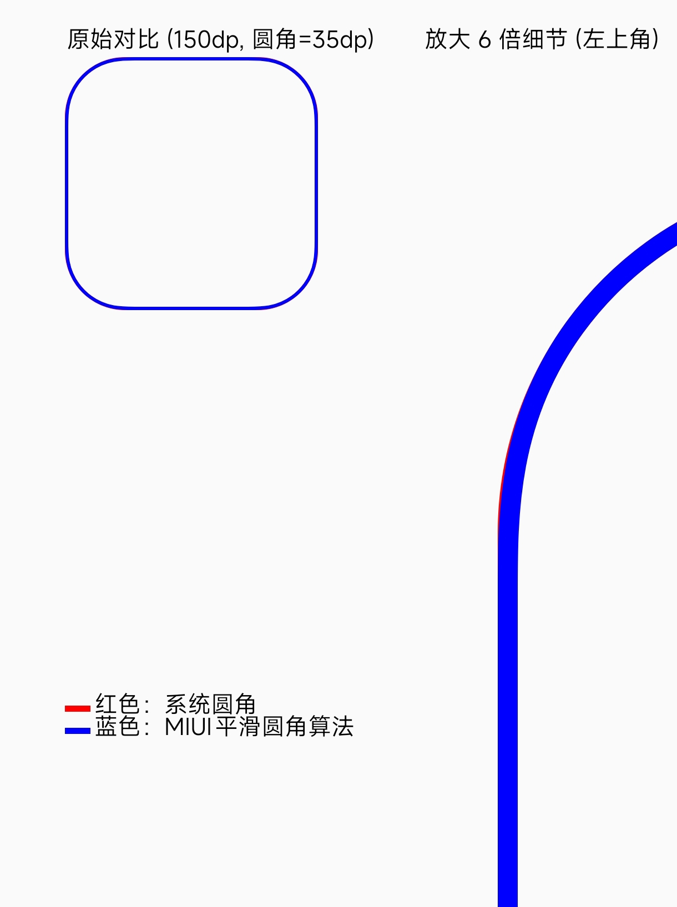

# MIUI 平滑圆角算法

**一个专为 Android 自定义 View 设计的 MIUI 风格平滑圆角算法，让圆角边缘更自然、更舒适**
-----------------------------------------------------------------------------------

## ✨ 项目简介

传统 Android 的 `setClipToOutline` + `RoundedCorner` 或 Canvas.drawRoundRect 实现的圆角，在某些情况下会出现“生硬的直线过渡”或“锯齿感”，尤其在高分辨率屏幕或复杂背景时特别明显。本项目通过反编译 **MIUI 系统应用** 的平滑圆角处理算法，实现**视觉上极致顺滑**的圆角效果。

**适用场景**：

- 自定义 View
- 图片圆角裁剪
- 弹窗、对话框、列表项
- 任何需要平滑圆角的 View
---

**📸 效果对比**：

- 蓝色为MIUI平滑圆角
- 红色为Android系统默认实现的圆角

---

## 🎯 核心特性

- ✅ **极致平滑**：消除传统圆角的“硬边”视觉突兀感- ✅ **MIUI 原生还原度**：视觉效果与小米系统应用圆角一致
- ✅ **目前仅支持ViewSystem**
- ⚠️ **若您需要Compose版本我将在后续更新至新的仓库**

---